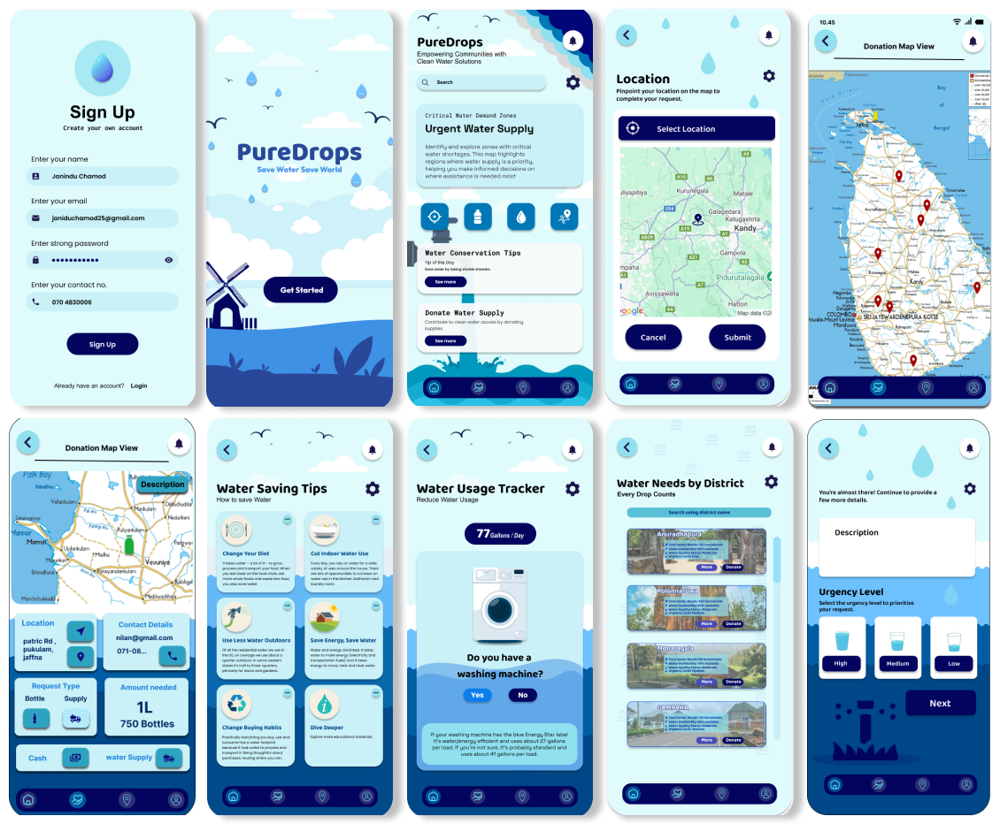

# PureDrops 💧
Transforming Water Management for a Sustainable Future

## Overview
PureDrops is a mobile application that focuses on clean water management and conservation. It empowers users to monitor their water consumption, request clean water, donate to water supply efforts, and visualize water usage data interactively. With sustainability at its core, PureDrops promotes mindful water use while connecting communities to clean water resources.

### Features

1. Water Consumption Tracker
- Track your daily water usage by answering simple questions.
- Set personalized water-saving goals.
- Receive reminders and notifications to stay on track.
- View progress through interactive graphical reports.
  
2. Request Clean Water
- Submit clean water requests for emergencies or shortages.
- Provide location details to enable efficient delivery.
- Track the status of your requests in real time.
  
3. Donate Water Supply
- Donate to water supply efforts for communities in need.
- Choose from predefined donation plans or customize your contribution.
- Track your donations and their impact over time.
  
4. Interactive Visualizations and Chatbot
- Explore insightful visualizations of water consumption patterns and goals.
- Engage with an AI-powered chatbot for tips on water conservation and sustainability.
- Get answers to common questions about water management.
  
5. Premium Features
- Access advanced features like Personalized Goal Setting and in-depth analysis of water usage.
- Receive exclusive tips and strategies to optimize water conservation.
  
6. Notifications and Alerts
- Receive updates on clean water availability in your area.
- Get reminders to meet water-saving goals or take action on pending requests.
  
## Technologies Used
- Frontend: Flutter for a smooth and responsive mobile experience.
- Backend: Firebase for real-time database, authentication, and cloud functions.
- APIs: Google Maps API for geolocation and tracking.
  
## Why PureDrops?
Water scarcity and inefficient water usage are global challenges. PureDrops provides a unified platform to address these issues by enabling:

- Awareness: Empower users with insights into their water consumption.
- Action: Facilitate donations and water-saving initiatives.
- Community: Connect individuals to resources for clean water.

